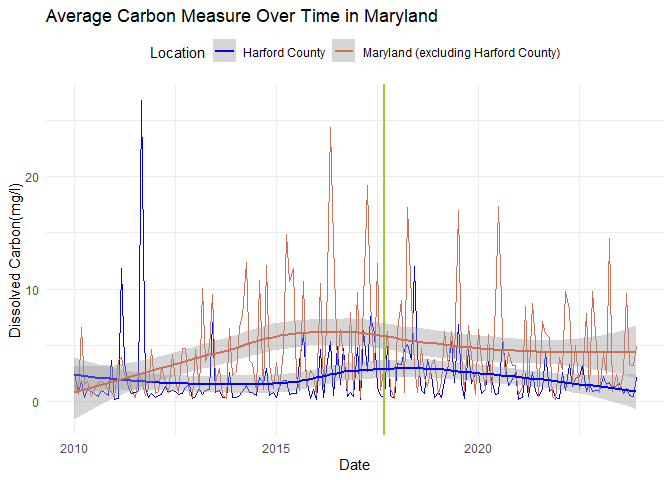
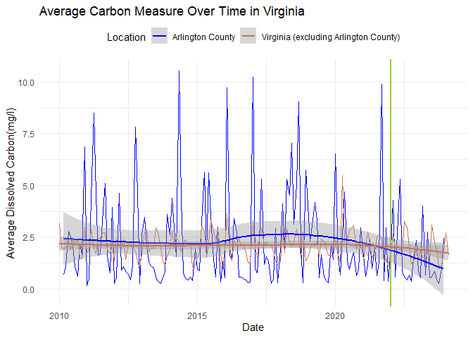

# Preliminary Research Results
2024 FIRE198 Sustainability Analytics

## Team Members

Lasya Muthyam, Sriya Peddinti

## Research Question

What are the effects of the plastic bag ban and tax on water quality in
the Chesapeake Bay?

## Background

In light of the escalating concerns over rising microplastic
concentrations in local watersheds, policymakers have been exploring
interventions to safeguard water quality from plastic pollution.
Notably, various jurisdictions around the Chesapeake Bay Watershed—an
integral estuarine system serving the DMV (D.C., Maryland, and Virginia)
and broader Northeastern United States(New York, Pennsylvania, Delaware,
and West Virginia)—have implemented measures such as plastic bag bans
and taxes. These measures aim to curtail the consumption and subsequent
pollution of plastic bags through taxes and complete bans of plastic
bags. For instance, Harford County in Maryland enacted a plastic bag ban
in September 2017, while Arlington and Fairfax counties in Virginia
introduced a plastic bag tax starting January 2022.

To critically evaluate the effectiveness of these policies and their
environmental ramifications, our study monitors changes in oceanic
carbon sequestration dynamics, specifically focusing on dissolved
organic carbon levels as research suggests that microplastics can
influence these levels by absorbing carbon particles when they degrade
in aquatic environments. Thereby, our research aims to determine the
impacts, if any, that plastic bag bans and taxes have on the dissolved
carbon levels within the Chesapeake Bay ecosystem.

## Data

The list of counties with plastic bag bans and taxes came from
banthebag.com, which also provides the dates of implementation of the
regulations.

The list of counties and states came from the Chesapeake Bay Foundation
website, which listed the counties that are considered to be a part of
the Chesapeake Bay watershed.

Water quality data came from the EPA US Water Quality Portal. We looked
at the dissolved carbon levels in a date range from 1-1-2010 to 3-1-2024
in the states/regions of New York, Pennsylvania, Maryland, Delaware, DC,
Virginia, and West Virginia.

We first calculated the average levels of dissolved carbon per location
per month. Then we checked if the list of Chesapeake Bay counties
implemented a bag ban or tax. Finally, we merged our regulation data
with our water quality data and attempted to analyze any trends we saw.

The code below shows how we cleaned our data:

``` r
library('tidyverse')
library('dplyr')
library(readr)

#One dataframe for each state/region we are looking at
wv <- read_csv("US_WQ_Data/WV_data.zip")
va <- read_csv("US_WQ_Data/VA_data.zip")
pa <- read_csv("US_WQ_Data/PA_data.zip")
ny <- read_csv("US_WQ_Data/NY_data.zip")
md <- read_csv("US_WQ_Data/MD_data.zip")
de <- read_csv("US_WQ_Data/DE_data.zip")
dc <- read_csv("US_WQ_Data/DC_data.zip")


# Site Data for each region
wv_station <- read.csv("Site Data/wv_station.csv")
va_station <- read.csv("Site Data/va_station.csv")
pa_station <- read.csv("Site Data/pa_station.csv")
ny_station <- read.csv("Site Data/ny_station.csv")
md_station <- read.csv("Site Data/md_station.csv")
de_station <- read.csv("Site Data/de_station.csv")
dc_station <- read.csv("Site Data/dc_station.csv")


############################## Cleaning Carbon Data ###############################

# West Virginia mean carbon levels
wv_data = select(wv,6,7,24,25,30,31,40:43, 45) # keeping columns we need
wv_data <- wv_data |>
  mutate(ResultMeasureValue= as.numeric(ResultMeasureValue)) |> # making ResultMeasureValue numeric
  filter(!is.na(ResultMeasureValue)) |> # getting rid of NA values
  mutate(date=as.Date(ActivityStartDate, format="%Y-%m-%d")) |> # changing date format
  mutate(month=month(date), year=year(date)) |> 
  filter(CharacteristicName=="Carbon") |> # Filtering out carbon data
  group_by(MonitoringLocationIdentifier, CharacteristicName, month, year) |>
  summarise(ResultMeasureValue=mean(ResultMeasureValue)) 

# Virginia mean carbon levels
va_data = select(va,6,7,24,25,30,31,40:43, 45) 
va_data <- va_data |>
  mutate(ResultMeasureValue= as.numeric(ResultMeasureValue)) |>
  filter(!is.na(ResultMeasureValue)) |> 
  mutate(date=as.Date(ActivityStartDate, format="%Y-%m-%d")) |>
  mutate(month=month(date), year=year(date)) |>
  filter(CharacteristicName=="Carbon") |>
  group_by(MonitoringLocationIdentifier, CharacteristicName, month, year) |>
  summarise(ResultMeasureValue=mean(ResultMeasureValue))

# Pennsylvania mean carbon levels
pa_data = select(pa,6,7,24,25,30,31,40:43, 45) #columns that we actually need
pa_data <- pa_data |>
  mutate(ResultMeasureValue= as.numeric(ResultMeasureValue)) |>
  filter(!is.na(ResultMeasureValue)) |> # NAs introduced by coercion !!!!
  mutate(date=as.Date(ActivityStartDate, format="%Y-%m-%d")) |>
  mutate(month=month(date), year=year(date)) |>
  filter(CharacteristicName=="Carbon") |>
  group_by(MonitoringLocationIdentifier, CharacteristicName, month, year) |>
  summarise(ResultMeasureValue=mean(ResultMeasureValue)) 

# New York mean carbon levels
ny_data = select(ny,6,7,24,25,30,31,40:43, 45) #columns that we actually need
ny_data <- ny_data |>
  mutate(ResultMeasureValue= as.numeric(ResultMeasureValue)) |>
  filter(!is.na(ResultMeasureValue)) |> # NAs introduced by coercion !!!!
  mutate(date=as.Date(ActivityStartDate, format="%Y-%m-%d")) |>
  mutate(month=month(date), year=year(date)) |>
  filter(CharacteristicName=="Carbon") |>
  group_by(MonitoringLocationIdentifier, CharacteristicName, month, year) |>
  summarise(ResultMeasureValue=mean(ResultMeasureValue))

# Maryland mean carbon levels
md_data = select(md,6,7,24,25,30,31,40:43, 45) #columns that we actually need
md_data <- md_data |>
  mutate(ResultMeasureValue= as.numeric(ResultMeasureValue)) |>
  filter(!is.na(ResultMeasureValue)) |> # NAs introduced by coercion !!!!
  mutate(date=as.Date(ActivityStartDate, format="%Y-%m-%d")) |>
  mutate(month=month(date), year=year(date)) |>
  filter(CharacteristicName=="Carbon") |>
  group_by(MonitoringLocationIdentifier, CharacteristicName, month, year) |>
  summarise(ResultMeasureValue=mean(ResultMeasureValue)) 

# Delaware mean carbon levels
de_data = select(de,6,7,24,25,30,31,40:43, 45) #columns that we actually need
de_data <- de_data |>
  mutate(ResultMeasureValue= as.numeric(ResultMeasureValue)) |>
  filter(!is.na(ResultMeasureValue)) |> # NAs introduced by coercion !!!!
  mutate(date=as.Date(ActivityStartDate, format="%Y-%m-%d")) |>
  mutate(month=month(date), year=year(date)) |>
  filter(CharacteristicName=="Carbon") |>
  group_by(MonitoringLocationIdentifier, CharacteristicName, month, year) |>
  summarise(ResultMeasureValue=mean(ResultMeasureValue)) 

# DC mean carbon levels
dc_data = select(dc,6,7,24,25,30,31,40:43, 45) #columns that we actually need
dc_data <- dc_data |>
  mutate(ResultMeasureValue= as.numeric(ResultMeasureValue)) |>
  filter(!is.na(ResultMeasureValue)) |> # NAs introduced by coercion !!!!
  mutate(date=as.Date(ActivityStartDate, format="%Y-%m-%d")) |>
  mutate(month=month(date), year=year(date)) |>
  filter(CharacteristicName=="Carbon") |>
  group_by(MonitoringLocationIdentifier, CharacteristicName, month, year) |>
  summarise(ResultMeasureValue=mean(ResultMeasureValue))


# Combining all the cleaned dataframes together
all_data <- rbind(wv_data, va_data, pa_data, ny_data, md_data, de_data, dc_data)

# CLEANING SITE DATA: MonitoringLocationIdentifier, County Code, State Code
wv_site = select(wv_station, 3, 26, 27)
va_site = select(va_station, 3, 26, 27)
pa_site = select(pa_station, 3, 26, 27)
ny_site = select(ny_station, 3, 26, 27)
md_site = select(md_station, 3, 26, 27)
de_site = select(de_station, 3, 26, 27)
dc_site = select(dc_station, 3, 26, 27)
all_sites <- rbind(wv_site, va_site, pa_site, ny_site, md_site, de_site, 
                      dc_site)

# MERGE EVERYTHING (site and values form all states data)
df_final <- 
  merge(all_data, all_sites, by = "MonitoringLocationIdentifier", all.x=TRUE) 

# Convert StateCode to character and pad CountyCode with leading zeros
df_final$StateCode <- as.character(df_final$StateCode)
df_final$CountyCode <- sprintf("%03d", as.numeric(df_final$CountyCode))

# Combine StateCode and padded CountyCode into a new column (FIPS)
df_final$fips <- paste0(df_final$StateCode, df_final$CountyCode)
df_final$fips <- as.integer(df_final$fips)

# Reading fips codes
fips_codes <- read.csv("fips-by-state.csv")

#Merging fips_codes with df_final
df_final <- merge(df_final, fips_codes, by = "fips")

# Ban Data
ban_tax <- read.csv("ban_tax.csv")

#Merging fips_codes and ban_tax
colnames(ban_tax) <- c("month_ban", "year_ban", "month_tax", 
                                  "year_tax", "ban", "tax", "name", "state")
ban_tax <- merge(ban_tax, fips_codes, by = "name")
ban_tax = select(ban_tax, 1:9)
colnames(ban_tax) <- c("name", "month_ban", "year_ban", 
                       "month_tax", "year_tax", "ban", "tax", "state", "fips")

# merging with df_final, and cleaning up the names and columns
df_final2 <- merge(df_final, ban_tax, by = c("fips"), all.x=TRUE)

df_final3<- df_final2 |>
  mutate(ban=ifelse(is.na(ban), 0, ban)) |>
  mutate(tax=ifelse(is.na(tax), 0, tax)) |>
  group_by(month, year, name.x, state.x, ban, tax, month_ban, year_ban, month_tax, year_tax) |>
  summarize(Carbon=mean(ResultMeasureValue))

#county characteristics
df_county<-df_final3 |>
  group_by(name.x, state.x, ban, tax, month_ban, year_ban, month_tax, year_tax) |>
  tally() 


names(df_final3)[names(df_final3) == 'name.x'] <- 'name'
names(df_final3)[names(df_final3) == 'state.x'] <- 'state'
names(df_county)[names(df_county) == 'name.x'] <- 'name'
names(df_county)[names(df_county) == 'state.x'] <- 'state'

# Final carbon data frame
df_final_carbon <- df_final3
df_final_carbon$month <- sprintf("%02d", df_final_carbon$month) 
df_final_carbon$date <- as.Date(with(df_final_carbon, paste(df_final_carbon$year, df_final_carbon$month, "01", sep = "-")), "%Y-
%m-%d")
```

## Preliminary Results

After observing all counties’ policy implementation dates, we noticed
most location recently (2022-2024) implemented their bag bans or taxes.
When gathering data, we defined sufficient dissolved carbon data as any
location with over 100 observations over a continuous period of time. We
found that Harford County is the only county in Maryland that
implemented a Bag Ban before 2024 that had sufficient dissolved carbon
data. We also found that Arlington County in Virginia is the only county
in Virginia that had a tax implemented before 2024 and had sufficient
dissolved carbon data.

The effects of the plastic bag ban on microplastic pollution in the
Chesapeake Bay are unclear from our current results. We cannot conclude
that the treatment variable, ban/tax, makes a significant impact on the
outcome variable, average dissolved carbon levels. This is due to a lack
of available data on counties that have implemented the ban or tax for
long periods of time. We hope to look into a number of external factors
in the future including storm water runoff and precipitation data that
could play a role in the levels of dissolved carbon.

These graphs display our results:

``` r
############################ Plot for Harford & Maryland ##########################

#Filter for harford county
harford_data <- df_final_carbon %>% 
  filter(name == "Harford County")

# Filter for Maryland (excluding Harford County)
md_data <- df_final_carbon %>% 
  filter(state == "MD" & name != "Harford County")

# Aggregate data by month and calculate the average carbon measure
hardford_monthly_avg <- harford_data %>%
  group_by(month = floor_date(date, "month")) %>%
  summarise(avg_carbon = mean(Carbon, na.rm = TRUE))

# Aggregate data by month and calculate the average carbon measure for Maryland
md_monthly_avg <- md_data %>%
  group_by(month = floor_date(date, "month")) %>%
  summarise(avg_carbon = mean(Carbon, na.rm = TRUE)) %>%
  mutate(location = "Maryland (excluding Harford County)")

# Combine the data frames for Harford County and Maryland
combined_data <- bind_rows(hardford_monthly_avg, md_monthly_avg)
combined_data2 <- combined_data %>%
  mutate(location = ifelse(is.na(location), "Harford County", location))

# Extract the plastic bag ban date for Harford County
# Assuming there's only one unique date for Harford County, adjust if necessary
ban_date_hf <- unique(harford_data %>% 
                     summarise(year_ban = unique(year_ban), month_ban = unique(month_ban)) %>%
                     mutate(ban_date = as.Date(paste(year_ban, month_ban, "01", sep = "-"))))$ban_date

# Plot
ggplot(combined_data2, aes(x = month, y = avg_carbon, color = location)) +
  geom_line() + # Line plot for both locations
  geom_vline(xintercept = as.numeric(ban_date_hf), linetype = "solid", color = "yellowgreen", lwd = 1) + # Vertical line for the ban date
  labs(title = "Average Carbon Measure Over Time in Maryland",
       x = "Date",
       y = "Dissolved Carbon(mg/l)",
       color = "Location") +
  scale_color_manual(
      name = 'Location',
      values = c("Harford County" = "blue", "Maryland (excluding Harford County)" = " salmon3"),
      labels = c("Harford County", "Maryland (excluding Harford County)")) + # Custom color palette
  theme_minimal() +
  theme(legend.position = "top") +
  geom_smooth() 
```



``` r
ggsave("md.jpg", width = 1500, height = 700, units="px")
```

``` r
######################### Plot for Arlington and Virginia #########################

# Filter for Virginia (excluding Arlington County)
va_c <- df_final_carbon %>%
  filter(state == "VA" & name != "Arlington County")

# Average VA per month data
va_monthly_avg <- va_c %>%
  group_by(month = floor_date(date, "month")) %>%
  summarise(avg_carbon = mean(Carbon, na.rm = TRUE)) %>%
  mutate(location = "Virginia (excluding Arlington County)")

# Arlington county data
ac_data <- df_final_carbon %>%
  filter(name == "Arlington County")

# Monthly average carbon data for Arlington
ac_monthly_avg <- ac_data %>%
  group_by(month = floor_date(date, "month")) %>%
  summarise(avg_carbon = mean(Carbon, na.rm = TRUE))

# Combining the two dataframes
combined_data <- bind_rows(ac_monthly_avg, va_monthly_avg)
combined_data2 <- combined_data %>%
  mutate(location = ifelse(is.na(location), "Arlington County", location))

# Virginia has a tax, so tax date
tax_date <- unique(ac_data %>% 
                     summarise(year_tax = unique(year_tax), month_tax = unique(month_tax)) %>%
                     mutate(tax_date = as.Date(paste(year_tax, month_tax, "01", sep = "-"))))$tax_date
```

    `summarise()` has grouped output by 'month', 'year', 'name', 'state', 'ban',
    'tax', 'month_ban', 'year_ban'. You can override using the `.groups` argument.

``` r
# Plot
ggplot(combined_data2, aes(x = month, y = avg_carbon, color = location)) +
  geom_line() + # Line plot for both locations
  geom_vline(xintercept = as.numeric(tax_date), linetype = "solid", color = "yellowgreen", lwd = 1) + # Vertical line for the ban date
  labs(title = "Average Carbon Measure Over Time in Virginia",
       x = "Date",
       y = "Average Dissolved Carbon(mg/l)",
       color = "Location") +
  scale_color_manual(
      name = 'Location',
      values = c("Arlington County" = "blue", "Virginia (excluding Arlington County)" = " salmon3"),
      labels = c("Arlington County", "Virginia (excluding Arlington County)")) + # Custom color palette
  theme_minimal() +
  theme(legend.position = "top") +
  geom_smooth() 
```

    `geom_smooth()` using method = 'loess' and formula = 'y ~ x'



``` r
ggsave("va.jpg", width=1500, height=700, units="px")
```

    `geom_smooth()` using method = 'loess' and formula = 'y ~ x'

## References

Seeley, M. E., Song, B., Passie, R., & Hale, R. C. (2020). Microplastics
affect sedimentary microbial communities and nitrogen cycling. Nature
Communications, 11(1).

Shen, M., Ye, S., Zeng, G., Zhang, Y., Xing, L., Tang, W., Wen, X., &
Liu, S. (2020). Can microplastics pose a threat to ocean carbon
sequestration? Marine Pollution Bulletin, 150, 110712.
